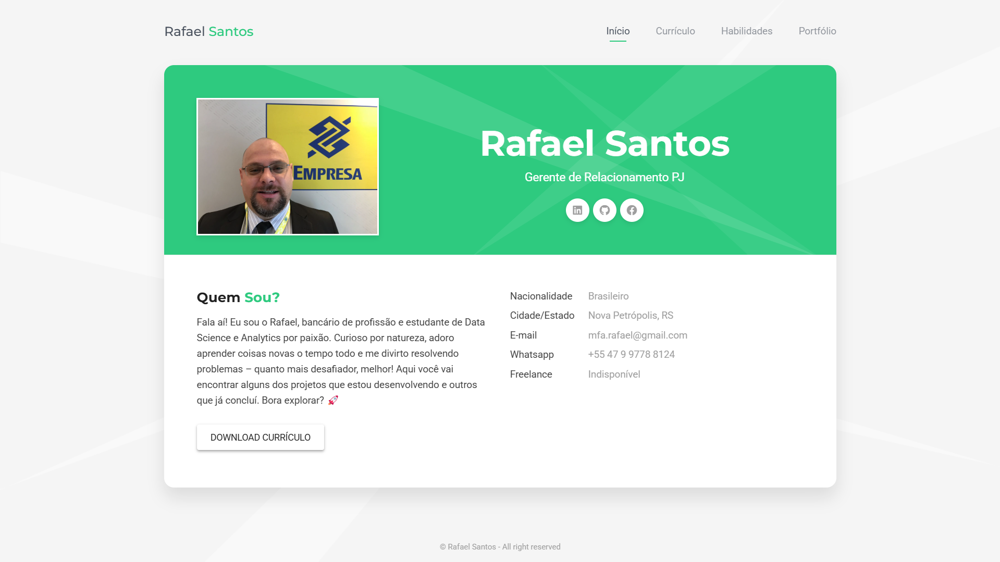
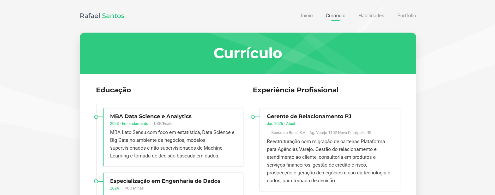
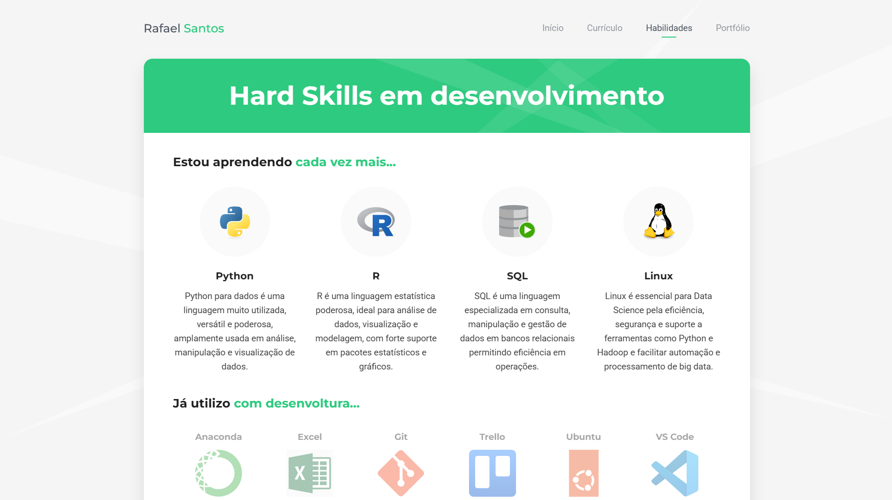
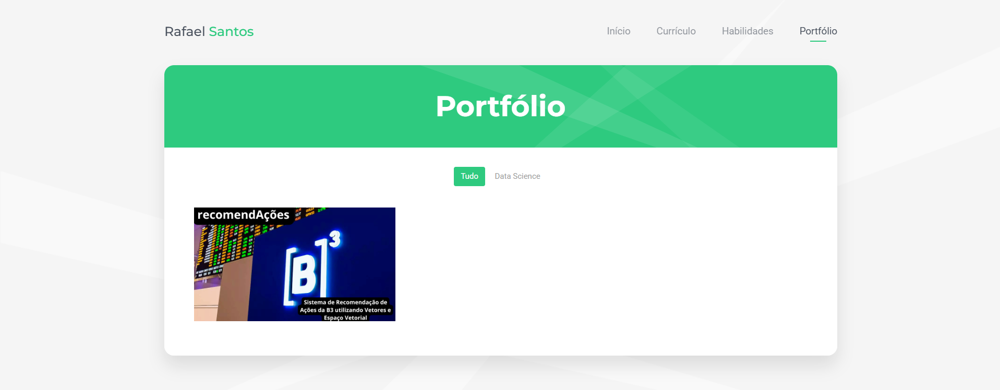

# Currículo Online e Portfólio de Data Science e Analytics

Este repositório contém o código-fonte de uma página web desenvolvida em HTML, CSS e JavaScript para exibir um currículo online e portfólio de projetos na área de Data Science e Analytics.

## 📚 Sobre o Projeto

A página web foi projetada para apresentar informações profissionais, habilidades, experiência e projetos desenvolvidos, proporcionando uma forma interativa e visualmente atrativa de demonstrar conhecimento na área de dados.

## 🎨 Layout

O layout segue uma abordagem moderna, com um design clean e responsivo, permitindo uma boa experiência do usuário tanto em desktops quanto em dispositivos móveis.

### Tela inicial

### Currículo

### Habilidades

### Portfólio

## 🛠️ Tecnologias Utilizadas

- **HTML5**: Estrutura da página
- **CSS3**: Estilização e responsividade
- **JavaScript**: Interatividade e dinamismo

## 🔍 Funcionalidades

- Exibição de informações profissionais e acadêmicas
- Portfólio de projetos com descrição e links para repositórios
- Seção de contato com links para redes sociais
- Design responsivo para diferentes dispositivos

## 📂 Estrutura do Projeto

- css/: Contém os arquivos de dados para estilização das páginas.
- cv/: Contém o Currículo Vitae.
- fonts/: Contém as fontes utilizadas no projeto.
- images/: Contém todas as imagens do projeto.
- js/: Contém os scripts de interatividade.
- index.html: página principal do projeto.

## 📋 Como Contribuir/se inspirar

1. Faça um fork, ou clone o repositório.  
2. Crie uma branch para a sua feature: `git checkout -b minha-feature`.  
3. Commit suas alterações: `git commit -m 'Adicionar nova feature'`.  
4. Submeta um pull request.  

## 📜 Licença

Este projeto está licenciado sob a licença MIT. Veja o arquivo `LICENSE` para mais detalhes.
---

Esperamos que este projeto ajude na sua jornada profissional! 🚀

